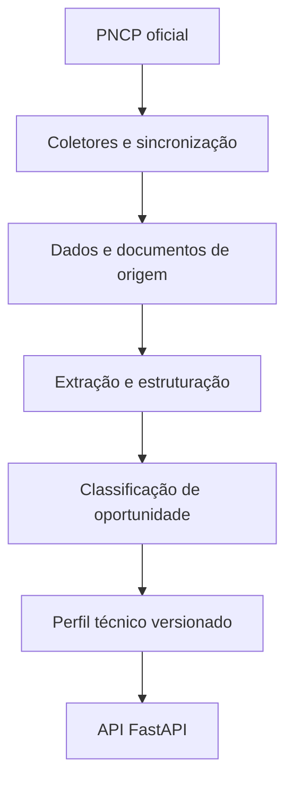

# Arquitetura do SIGARP

## Visão geral

O backend é um monólito modular em camadas. A ingestão preserva os dados oficiais;
a classificação e a avaliação técnica são etapas separadas e reprocessáveis.

A API valida contratos e traduz erros; serviços orquestram casos de uso;
repositórios isolam a persistência; modelos SQLAlchemy representam o PostgreSQL.

## Diretórios

- `app/api`: rotas, dependências e handlers.
- `app/clients` e `app/collectors`: acesso resiliente às fontes oficiais.
- `app/core`: configuração, logging e exceções.
- `app/database`: engine, sessões e base ORM.
- `app/models`: modelos SQLAlchemy.
- `app/repositories`: acesso a dados.
- `app/schemas`: contratos Pydantic.
- `app/services`: regras e casos de uso.
- `app/sync`: ingestão idempotente de contratações, itens e documentos.
- `app/profiles`: critérios técnicos objetivos e versionados.
- `tests`: testes automatizados.

## Princípios

- API-first.
- Dados oficiais preservados.
- Separação entre dado bruto e normalizado.
- Neutralidade na comparação.
- Rastreabilidade.
- Perfis imutáveis por versão.
- Classificação automatizada não substitui decisão humana.
- Migrations obrigatórias.
- Configuração por variáveis de ambiente.

## Inicialização

`create_app()` monta a aplicação, registra rotas, middleware e handlers.
Isso permite testar e evoluir a inicialização sem concentrar tudo em `main.py`.

## Limites dos módulos

- coletores não aplicam pontuação técnica;
- extração não decide adequação;
- perfis não contêm marca, fabricante, fornecedor ou família comercial;
- avaliações registram a versão do perfil;
- uma futura integração SUAP deve usar adaptador próprio, idempotência e fila
  persistente, sem acoplamento ao domínio de busca.

## Decisões

As decisões arquiteturais estão em `docs/adr`. O ADR-005 torna obrigatórios os
perfis neutros e versionados a partir da alpha6.
